# EduZim Platform

A comprehensive school management system built for Zimbabwe's education sector. EduZim provides dashboards for administrators, teachers, and parents — covering students, classes, attendance, fees, assessments, communication, and dropout intelligence.

<p align="center">
  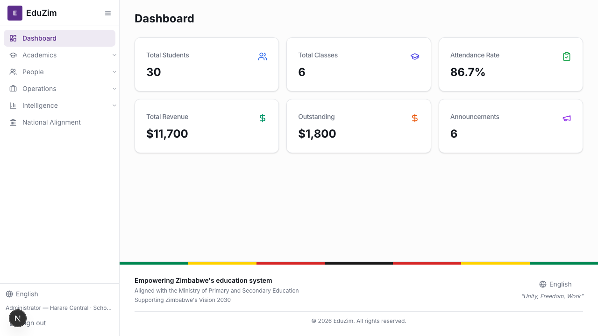
  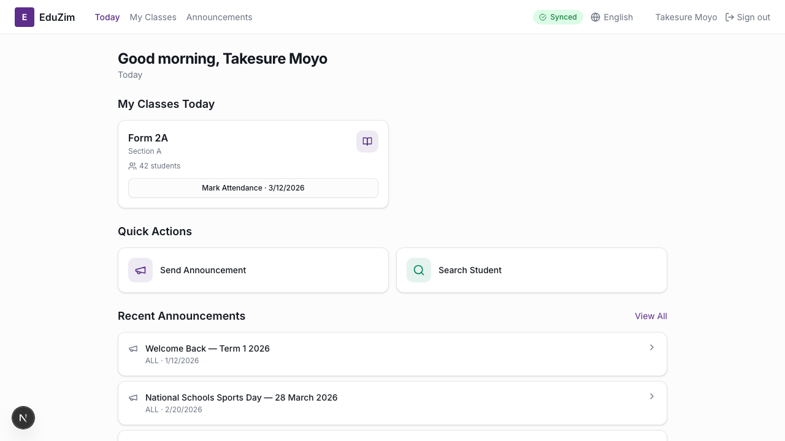
  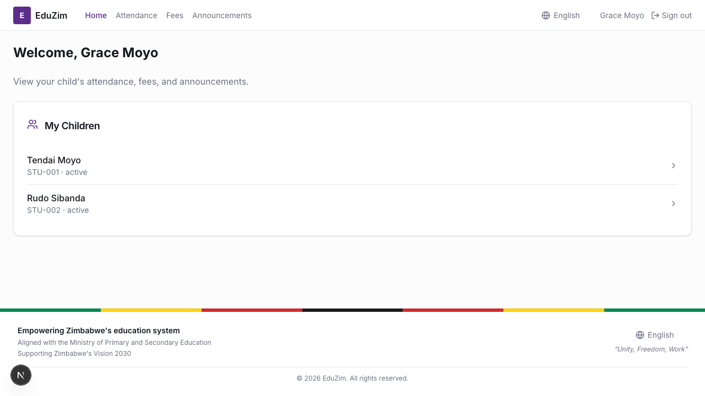
</p>

---

## Architecture

- **Frontend**: 3 Next.js apps (admin-web, teacher-web, parent-web) sharing a common UI library and API client
- **Backend**: Python microservices (auth, school, student, attendance, fees, communication, reporting)
- **Packages**: `@eduzim/ui`, `@eduzim/auth`, `@eduzim/api-client`, `@eduzim/offline-core`

## Quick Start

```bash
pnpm install
pnpm run build

# Run with mock data (no backend needed)
NEXT_PUBLIC_MOCK_DATA=true pnpm run dev:admin    # http://localhost:3000
NEXT_PUBLIC_MOCK_DATA=true pnpm --filter teacher-web dev  # http://localhost:3002
NEXT_PUBLIC_MOCK_DATA=true pnpm --filter parent-web dev   # http://localhost:3001
```

---

## 📸 Portal Screenshots

### 🏫 Admin Portal

Full school management: students, classes, fees, attendance, assessments, reports, CSV import, and dropout intelligence. Supports English and Shona.

<p align="center">
  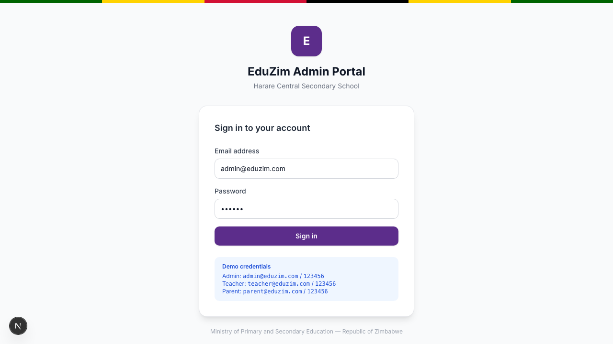
  
  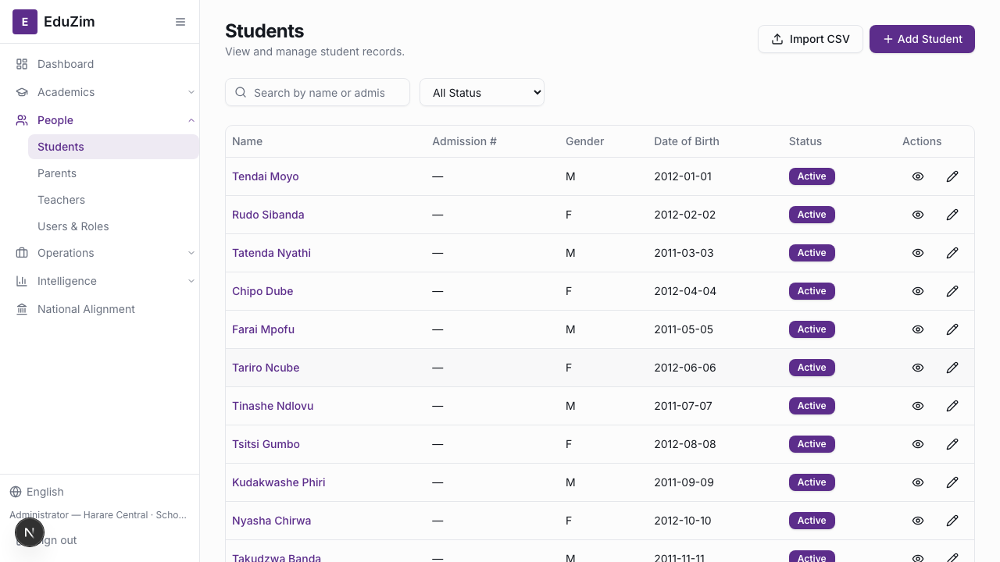
</p>
<p align="center">
  <em>Login &nbsp;·&nbsp; Dashboard Overview &nbsp;·&nbsp; Students List</em>
</p>

<p align="center">
  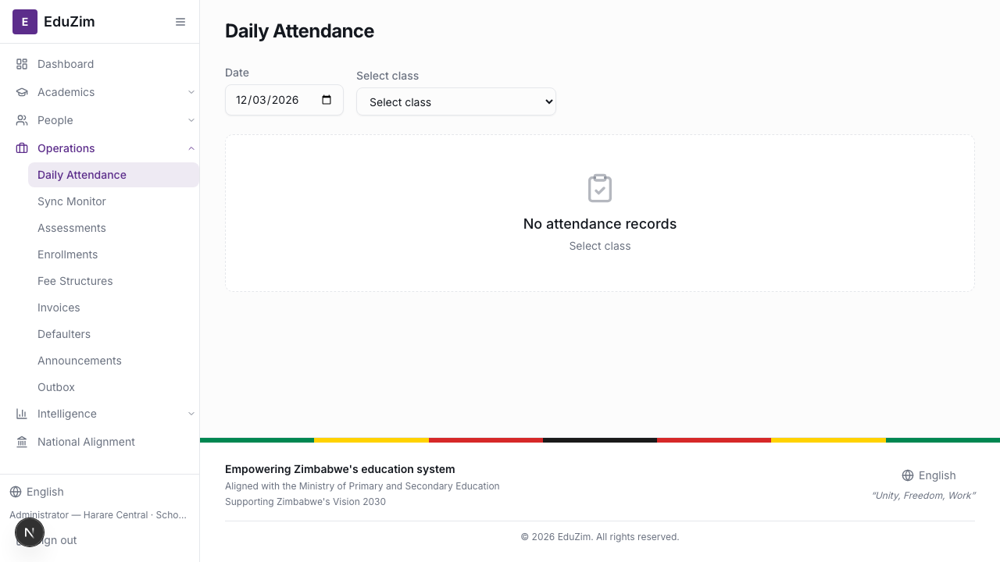
  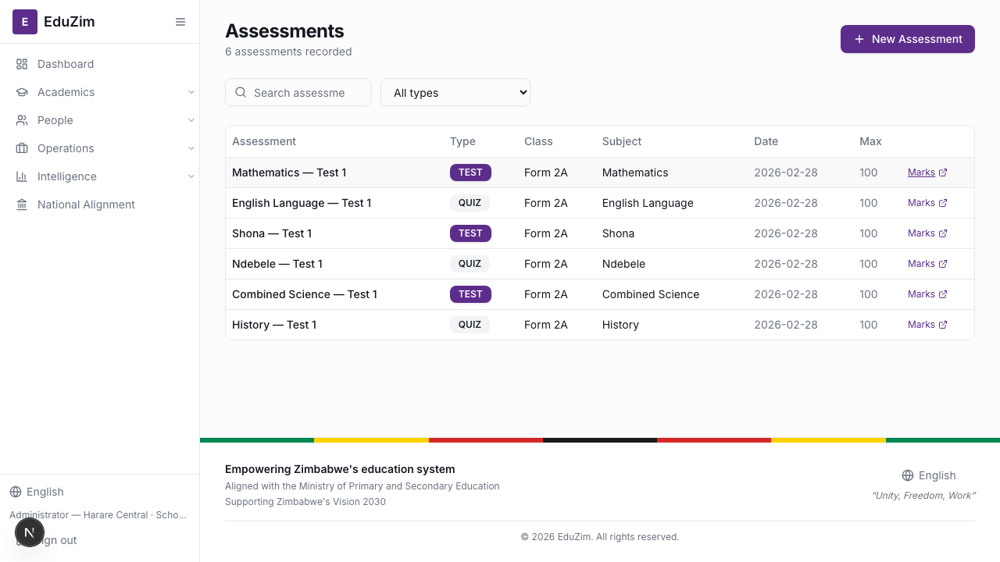
  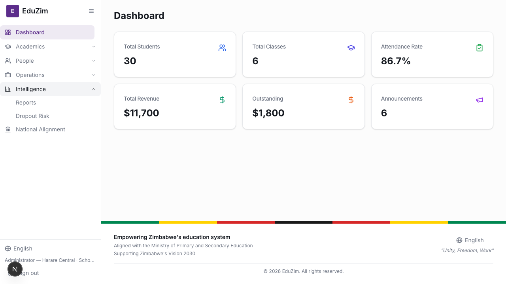
</p>
<p align="center">
  <em>Attendance Tracking &nbsp;·&nbsp; Assessments &nbsp;·&nbsp; English / Shona Language Switch</em>
</p>

**Key pages**: Dashboard · Students · Attendance · Fees & Invoices · Assessments · Enrollments · Announcements · Reports · CSV Import

---

### 📚 Teacher Portal

Class management, attendance marking, assessments, offline sync, and announcements. Works offline with background sync.

<p align="center">
  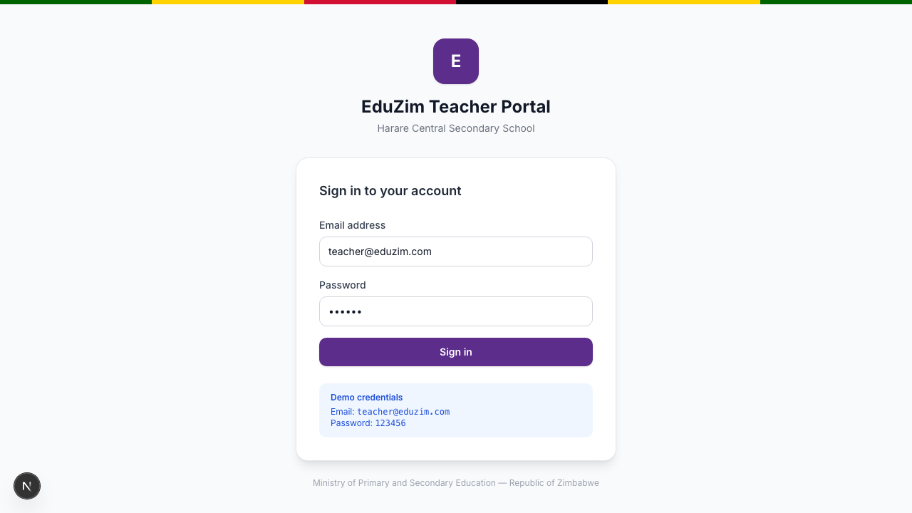
  
  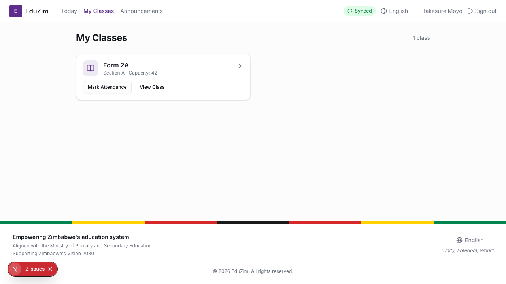
</p>
<p align="center">
  <em>Login &nbsp;·&nbsp; Today (Daily Schedule) &nbsp;·&nbsp; My Classes</em>
</p>

<p align="center">
  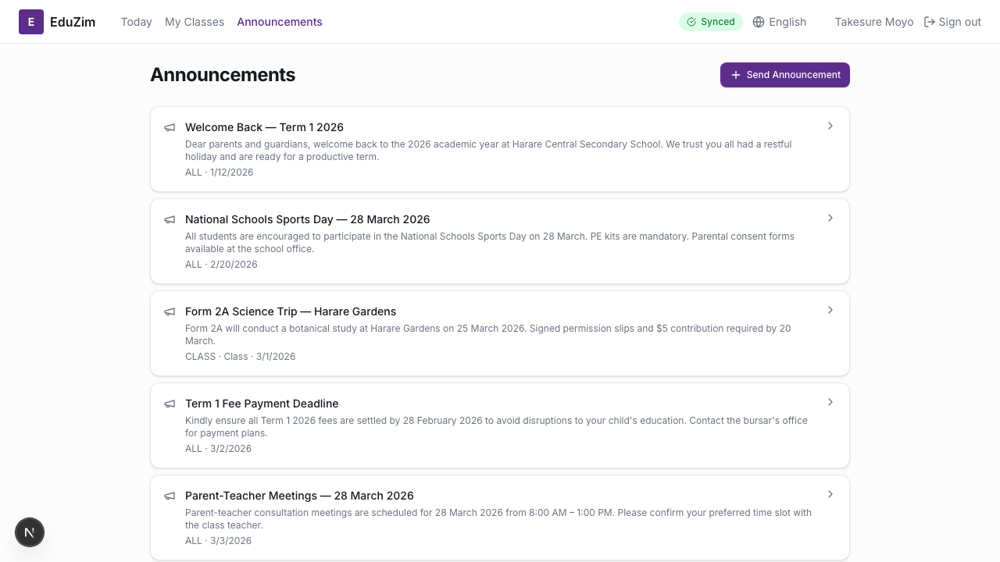
  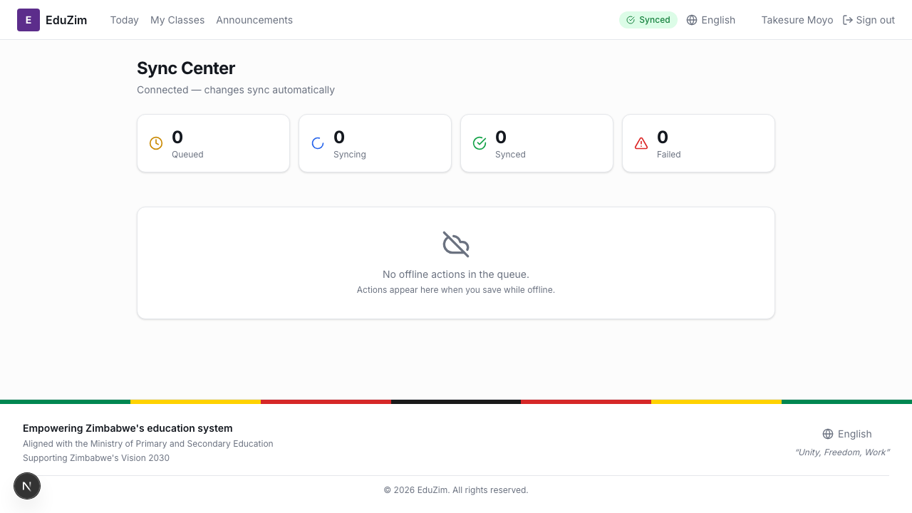
  
</p>
<p align="center">
  <em>Announcements &nbsp;·&nbsp; Offline Sync Center &nbsp;·&nbsp; Shona Language Mode</em>
</p>

**Key pages**: Today · My Classes · Class Detail · Announcements · Sync Center

---

### 👨‍👩‍👧 Parent Portal

View children's information, attendance trends, fee balances, and school announcements. Available in English and Shona.

<p align="center">
  
  
  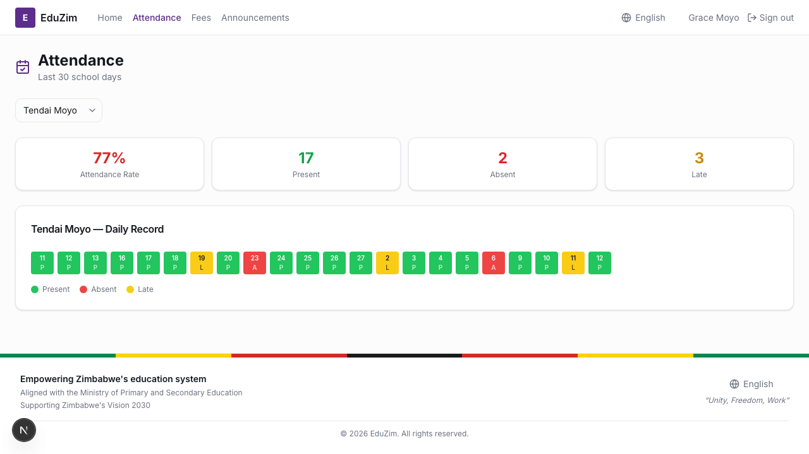
</p>
<p align="center">
  <em>Login &nbsp;·&nbsp; Home (My Children) &nbsp;·&nbsp; Attendance Summary</em>
</p>

<p align="center">
  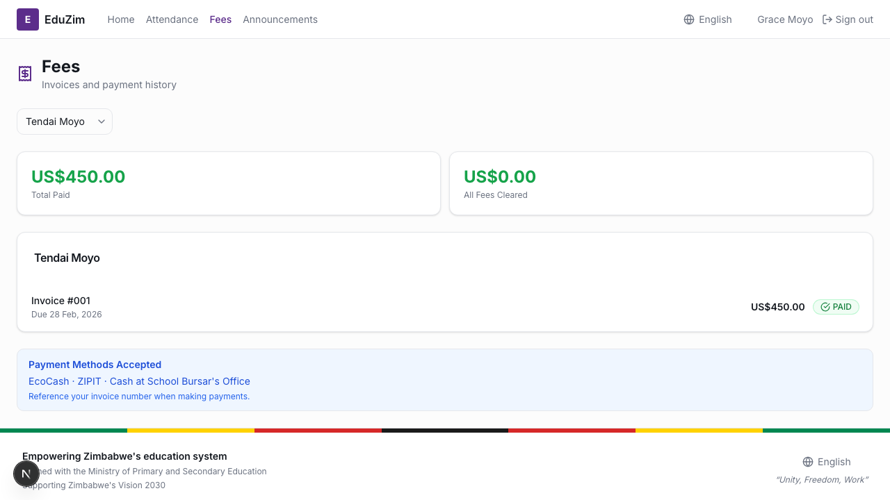
  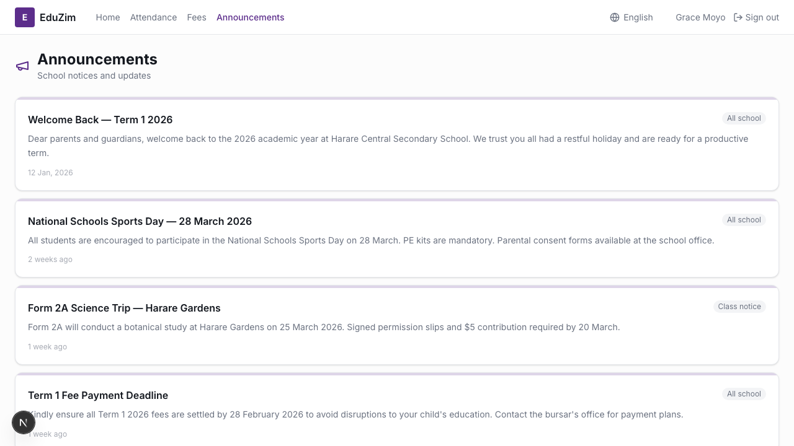
  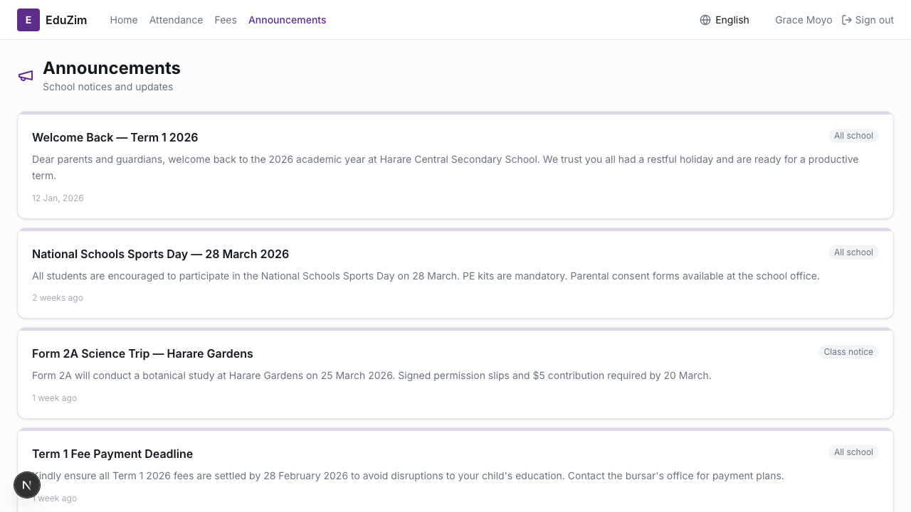
</p>
<p align="center">
  <em>Fees & Payments &nbsp;·&nbsp; School Announcements &nbsp;·&nbsp; English / Shona Toggle</em>
</p>

**Key pages**: Home · Attendance · Fees · Announcements

---

## Mock Data

All dashboards include centralized mock data (20 students, 10 parents, 4 classes, 6 subjects) that is consistent across all 3 apps. Enable it by setting:

```
NEXT_PUBLIC_MOCK_DATA=true
```

## Tech Stack

| Layer | Technology |
|-------|-----------|
| Frontend | Next.js 15, React, TypeScript |
| UI Library | Custom `@eduzim/ui` component library |
| Auth | JWT + cookie-based refresh via `@eduzim/auth` |
| API Client | Typed fetch wrapper via `@eduzim/api-client` |
| i18n | `next-intl` (English + Shona) |
| Backend | Python (FastAPI), PostgreSQL, Kafka |
| Testing | Playwright (E2E), Vitest |

## Project Structure

```
apps/
  admin-web/     # Admin dashboard (port 3000)
  parent-web/    # Parent portal (port 3001)
  teacher-web/   # Teacher dashboard (port 3002)
packages/
  api-client/    # Typed API client + mock data
  auth/          # Auth context + token management
  ui/            # Shared UI components
  offline-core/  # Offline queue + sync engine
services/
  auth-service/       # Authentication
  school-service/     # School, classes, subjects
  student-service/    # Students, parents, enrollments
  attendance-service/ # Attendance tracking
  fee-service/        # Fees, invoices, payments
  comm-service/       # Announcements, notifications
  reporting-service/  # Dashboard, trends, dropout AI
```

## License

MIT
