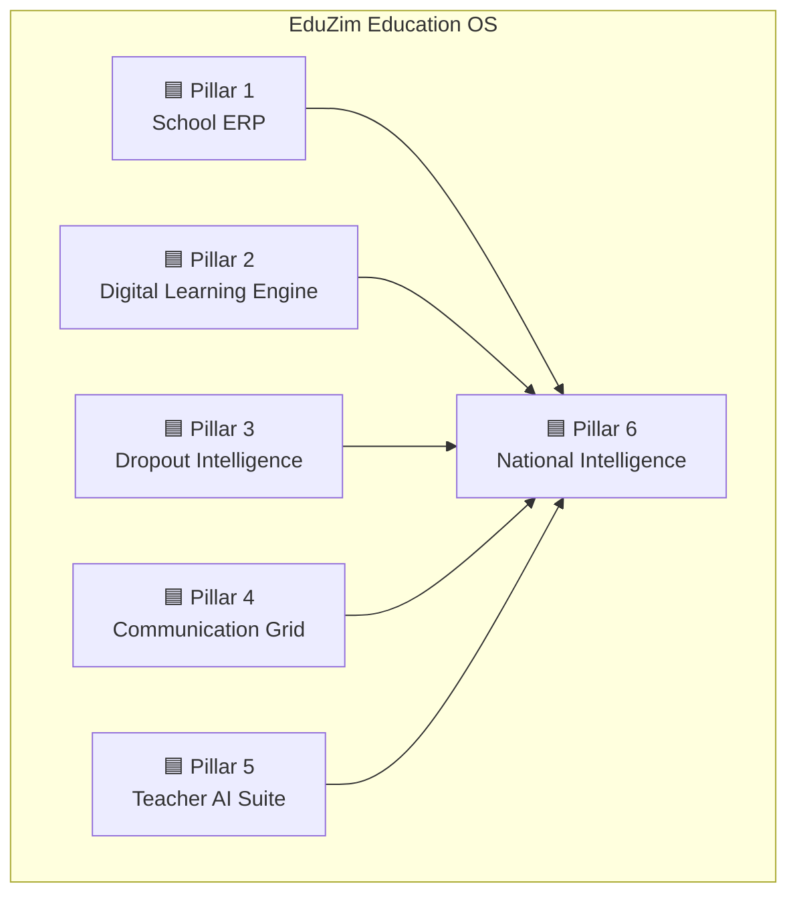
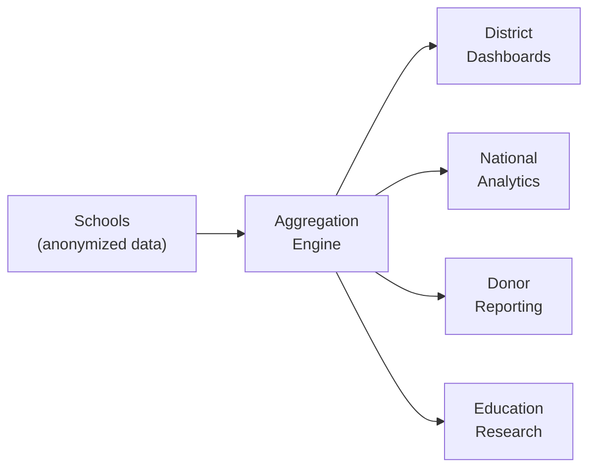

# EduZim — Education Operating System for Emerging Nations

> [!CAUTION]
> **This document is the long-term aspirational vision, not current build status.**
>
> Many features described below — AI lesson planning, biometric attendance, edge-server hardware tiers, national intelligence layer, hybrid cloud/edge architecture, "40–60% workload reduction" — are **not built**. Some are planned (see `task.md`); some are aspirational; some are marketing language we should not repeat in decks or to schools.
>
> **For what is actually verified, partial, or unbuilt, see [`STATUS.md`](./STATUS.md).**
>
> For locked design decisions (e.g., integration-only via Provider interfaces, not native payments/SMS/content), see [`docs/decisions/`](./docs/decisions/).
>
> When pitching, demoing, or onboarding schools, treat `STATUS.md` as authoritative. This document remains here as the north-star horizon — useful, but not factual about today.

---

> **Vision**: Build the definitive education infrastructure platform for Sub-Saharan Africa — starting with Zimbabwe and Zambia, expanding across East and Southern Africa.

Built for **low bandwidth today**. Ready for **high connectivity tomorrow**.

---

## Table of Contents

1. [Strategic Positioning](#1-strategic-positioning)
2. [Core Architecture Philosophy](#2-core-architecture-philosophy)
3. [The 6 Strategic Pillars](#3-the-6-strategic-pillars)
4. [Hardware Deployment Strategy](#4-hardware-deployment-strategy)
5. [Future Differentiators](#5-future-differentiators)
6. [Investor Deck Structure](#6-investor-deck-structure)
7. [Build Complexity & Staging](#7-build-complexity--staging)

---

## 1. Strategic Positioning

### What EduZim Is NOT

- ❌ A basic offline LMS for schools
- ❌ A 3-month MVP SaaS product
- ❌ A simple classroom management tool

### What EduZim IS

**An Education Operating System** — a multi-year infrastructure platform that combines:

| Capability         | Analogy                |
| ------------------ | ---------------------- |
| Learning Engine    | Netflix for Education  |
| School ERP         | SAP for Schools        |
| Classroom OS       | Google Classroom (offline-first) |
| Intelligence Layer | National Education Analytics |

### Target Markets

| Phase   | Region                        | Timeline   |
| ------- | ----------------------------- | ---------- |
| Phase 1 | 🇿🇼 Zimbabwe                  | Year 1     |
| Phase 2 | 🇿🇲 Zambia                    | Year 1–2   |
| Phase 3 | East & Southern Africa        | Year 2–4   |

---

## 2. Core Architecture Philosophy

EduZim is designed across **3 infrastructure realities** — ensuring the platform remains relevant today and indispensable tomorrow.

### Reality A — Present (Low Infrastructure)

> The reality most schools face **today**.

| Challenge            | EduZim Response                                |
| -------------------- | ---------------------------------------------- |
| Low bandwidth        | Offline-first architecture, daily sync model   |
| Device scarcity      | Shared tablet support, projector mode           |
| Teacher overload     | AI productivity tools, automated grading        |
| Manual admin systems | Full school ERP digitization                    |
| Dropout tracking gaps| Intelligent risk scoring engine                 |

### Reality B — Transition (5 Years)

> Infrastructure is improving — satellite, fiber, solar, government mandates.

| Trend                          | EduZim Response                            |
| ------------------------------ | ------------------------------------------ |
| Satellite + fiber expansion    | Hybrid cloud/edge architecture             |
| Solar-powered schools          | Solar-compatible hardware tiers            |
| Government digitization mandates | Ministry-ready compliance & reporting    |
| Donor hardware programs        | Pre-configured deployment packages         |

### Reality C — Future (10–15 Years)

> Full digital transformation of education systems across the continent.

| Future State                      | EduZim Response                          |
| --------------------------------- | ---------------------------------------- |
| AI-assisted learning              | Personalized learning paths              |
| Hybrid physical + digital school  | Blended learning platform                |
| National performance analytics    | Education Intelligence Layer             |
| Cross-border curriculum mobility  | Portable digital student IDs             |

> [!IMPORTANT]
> **Design Principle**: Every feature must work in Reality A. Every architecture decision must scale to Reality C. No exceptions.

---

## 3. The 6 Strategic Pillars



---

### 🟦 PILLAR 1 — Complete School ERP (Institution Backbone)

> Not basic admin. **Full enterprise-grade ERP.**

#### 1.1 Academic Management

- Class structures & sections
- Timetable automation
- Syllabus tracking & version control
- Continuous assessment tracking
- Online + offline exam management
- Standardized performance benchmarking

#### 1.2 Student Lifecycle Management

```
Admission → Enrollment → Progression → Graduation
                ↕
         Transfer Management
                ↓
      Academic Transcript Engine
                ↓
       Dropout Risk Scoring (→ Pillar 3)
```

- Full student journey from admission to graduation
- Inter-school transfer management
- Academic transcript generation engine
- Dropout risk scoring integration with Pillar 3

#### 1.3 Fee & Financial Transparency

| Feature                        | Description                                |
| ------------------------------ | ------------------------------------------ |
| Fee breakdown visibility       | Itemized fee display per student           |
| Installment tracking           | Flexible payment plan management           |
| Payment channels               | Bank, mobile money (EcoCash, Innbucks etc.)|
| Donor subsidy tracking         | Track donor-funded fee subsidies           |
| Financial reporting            | Reports for school boards                  |
| Public audit dashboard         | Optional transparency layer                |

#### 1.4 HR & Payroll

- Teacher performance metrics
- Contract management
- Leave tracking
- Payroll integration
- Staff attendance

> [!NOTE]
> **Sticky Factor**: A school running its entire administration on EduZim has extremely high switching costs. This is by design.

---

### 🟦 PILLAR 2 — National Digital Learning Engine

> Not just content hosting. A **complete hybrid learning platform**.

#### 2.1 Offline-First LMS

| Feature                      | Details                                   |
| ---------------------------- | ----------------------------------------- |
| Daily sync model             | Sync once daily when connectivity exists  |
| Content caching              | Intelligent local caching on edge devices |
| Version-controlled syllabus  | Track syllabus updates with versioning    |
| Progressive sync             | Priority-based content synchronization    |

#### 2.2 Hybrid Learning Model

- **Classroom teaching** — digital augmentation of in-person lessons
- **Homework digitalization** — assign, submit, grade digitally (offline-capable)
- **Recorded lessons repository** — teacher-recorded & curated video library
- **Low-bandwidth video compression** — optimized video formats for constrained networks

#### 2.3 Global Licensed Content Integration (Optional Add-Ons)

| Content Track              | Examples                                      |
| -------------------------- | --------------------------------------------- |
| STEM Labs                  | Virtual science experiments, simulations       |
| Coding Curriculum          | Scratch, Python, web development               |
| Global Certifications      | Cambridge, IB, local exam body alignment       |
| Skill-based Modules        | Financial literacy, digital skills, agriculture|

> **Positioning**: *"Netflix + ERP + Classroom OS"*

---

### 🟦 PILLAR 3 — Dropout & Attendance Intelligence System

> **This is where EduZim truly differentiates.** This capability alone can save thousands of children.

#### 3.1 Smart Attendance

| Method              | Connectivity Requirement |
| ------------------- | ----------------------- |
| Teacher-marked      | Offline ✅               |
| Biometric (optional)| Offline ✅               |
| QR Code             | Offline ✅               |
| RFID                | Offline ✅               |

All methods support offline validation with sync-when-available.

#### 3.2 Dropout Risk Engine

AI + rules-based engine that combines multiple risk signals:

```
┌─────────────────────────────────────────────────────┐
│                DROPOUT RISK ENGINE                   │
├─────────────────────────────────────────────────────┤
│                                                      │
│  📉 Attendance decline trends                       │
│  💰 Fee non-payment correlation                     │
│  📊 Performance decline patterns                    │
│  🏠 Household risk markers                          │
│  ⏰ Behavioral indicators                           │
│                                                      │
│          ↓ Combined Risk Score ↓                     │
│                                                      │
│  🚨 Early Warning Alerts → Teachers, Admin, Parents │
│                                                      │
└─────────────────────────────────────────────────────┘
```

> [!CAUTION]
> **Ministry Impact**: This feature is *extremely powerful* in government and Ministry of Education discussions. It provides tangible evidence of intervention impact and can directly influence education policy.

---

### 🟦 PILLAR 4 — Stakeholder Communication Grid

> **Communication is infrastructure.**

#### 4.1 Supported Channels

| Channel                   | Use Case                                    |
| ------------------------- | ------------------------------------------- |
| SMS                       | Universal reach, fee reminders              |
| WhatsApp Business API     | Rich messaging, homework alerts             |
| In-app messaging          | Internal school communication               |
| Email                     | Formal communications, reports              |
| Community bulletin boards | School-wide announcements                   |
| Emergency broadcast       | Critical alerts, closures                   |

#### 4.2 Communication Features

- **Parent-teacher booking system** — schedule meetings digitally
- **Announcement broadcast** — multi-channel school announcements
- **Homework alerts** — automatic notifications on assignments
- **Fee reminders** — automated payment reminders
- **Behavioral alerts** — conduct notifications to parents
- **School policy updates** — version-controlled policy distribution

---

### 🟦 PILLAR 5 — Teacher AI & Productivity Suite

> Teachers are the bottleneck. These tools **reduce workload by 40–60%**.

#### 5.1 AI Capabilities

| Tool                              | Description                                   |
| --------------------------------- | --------------------------------------------- |
| Lesson plan generator             | Aligned to local syllabus (ZIMSEC, Zambian)   |
| Homework auto-grader              | AI-powered grading with feedback generation   |
| Exam question bank generator      | Create varied assessments from syllabus topics|
| Personalized remediation          | Student-specific improvement suggestions      |
| Offline AI assistant              | Edge-optimized models for offline use         |
| Performance analytics dashboard   | Visual insights into class & student progress |

> [!TIP]
> **Long-term Moat**: The AI suite becomes the primary reason teachers advocate for EduZim adoption. Teacher advocacy drives school-level retention.

---

### 🟦 PILLAR 6 — National Education Intelligence Layer

> **Future-scale capability.** Makes EduZim indispensable to governments.

All data is **aggregated and anonymized**.

#### 6.1 Intelligence Capabilities

| Capability                          | Stakeholder                       |
| ----------------------------------- | --------------------------------- |
| District-level performance heatmaps | Ministry of Education             |
| Curriculum impact analysis          | Curriculum Development Unit       |
| Dropout hotspot identification      | Child welfare agencies            |
| Teacher performance distribution    | Teacher training colleges         |
| Resource allocation optimization    | Education budget planners         |
| Grant impact reporting              | Donors, NGOs, development banks   |



---

## 4. Hardware Deployment Strategy

Three deployment tiers mapped to school infrastructure realities.

### Tier 1 — Smart Hub (Rural Schools)

> Minimal infrastructure, maximum impact.

| Component         | Specification              |
| ----------------- | -------------------------- |
| Edge Server       | Low-power ARM-based device |
| Power             | Solar backup system        |
| Connectivity      | WiFi router (local mesh)   |
| Devices           | 15–30 shared tablets       |
| Display           | Projector for group learning|

### Tier 2 — Hybrid Campus (Urban Schools)

> Connected but not cloud-dependent.

| Component         | Specification              |
| ----------------- | -------------------------- |
| Edge Server       | Mid-range server           |
| Network           | Full LAN infrastructure    |
| Teacher Devices   | Laptops / tablets          |
| Display           | Smart boards per classroom |
| Connectivity      | Broadband + edge fallback  |

### Tier 3 — Cloud-Heavy Campus (Future)

> Full cloud operations with thin edge.

| Component         | Specification              |
| ----------------- | -------------------------- |
| Edge Device       | Thin client for caching    |
| Operations        | Primarily cloud-hosted     |
| Devices           | 1:1 student devices        |
| Connectivity      | Reliable broadband / fiber |

---

## 5. Future Differentiators

Features that elevate EduZim beyond current African EdTech.

### 🔹 Digital ID for Students

- Portable digital academic identity
- Transferable between schools and districts
- Blockchain-optional verification layer
- Foundation for lifelong learning records

### 🔹 National Exam Simulation Engine

- Mock exams at scale (ZIMSEC, Zambian exam board alignment)
- Performance ranking across schools (anonymized)
- Question difficulty calibration
- Gap analysis and targeted revision

### 🔹 Skills Marketplace

Schools subscribe to add-on tracks:

| Track                      | Description                        |
| -------------------------- | ---------------------------------- |
| Coding                     | Scratch → Python → Web Dev         |
| Entrepreneurship           | Business basics, financial literacy|
| Digital Literacy           | Computer skills certification      |
| Agriculture                | Modern farming techniques          |
| Trade Skills               | Vocational training modules        |

### 🔹 Career Pathway Engine (Secondary Level)

- Aptitude assessments
- Career matching algorithms
- Scholarship matching & application support
- Vocational pathway recommendations
- University preparation guidance

### 🔹 Device Usage Analytics

| Metric                   | Purpose                               |
| ------------------------ | ------------------------------------- |
| Learning engagement time | Measure active learning vs idle       |
| Screen time tracking     | Student wellbeing                     |
| Content effectiveness    | Which materials drive best outcomes   |
| Feature adoption         | Product improvement insights          |

### 🔹 Parent Financial Dashboard

- Transparent fee breakdown
- School expenditure summaries
- Infrastructure investment visibility
- Comparison benchmarks (optional)
- Receipt and payment history

---

## 6. Investor Deck Structure

### Current State

The existing presentation covers:
- Smart classroom
- Digital content
- Attendance
- TLMS
- Mobile app
- Value proposition

### Upgraded Elite Deck Structure

| Slide # | Title                                       | Purpose                           |
| ------- | ------------------------------------------- | --------------------------------- |
| 1       | The Education Gap in Zimbabwe & Zambia      | Problem framing                   |
| 2       | Why Current LMS Models Fail                 | Competitive gap analysis          |
| 3       | The Infrastructure Problem                  | Context for offline-first design  |
| 4       | EduZim OS — Platform Overview               | High-level solution               |
| 5       | Architecture Diagram (Cloud + Edge + Sync)  | Technical credibility             |
| 6       | 6 Strategic Pillars                         | Complete platform scope           |
| 7       | Dropout Intelligence Engine                 | Impact/differentiation slide      |
| 8       | Government Partnership Model                | B2G strategy                      |
| 9       | Private School Monetization Model           | B2B strategy                      |
| 10      | Deployment Strategy (Hub model)             | Go-to-market execution            |
| 11      | 3-Year Expansion Map                        | Geographic growth plan            |
| 12      | Revenue Streams                             | Business model                    |
| 13      | Unit Economics                              | Financial viability               |
| 14      | Competitive Landscape                       | Market positioning                |
| 15      | Why We Win                                  | Defensibility & moat              |
| 16      | Roadmap                                     | Execution timeline                |
| 17      | Team Vision                                 | Founding team                     |
| 18      | The Ask                                     | Funding request                   |

---

## 7. Build Complexity & Staging

### Complexity Assessment

> [!WARNING]
> **Complexity Level: HIGH** — This is a multi-year infrastructure build, not a 3-month MVP.

**What this project involves:**

- Multi-tenant SaaS architecture
- Edge computing + cloud hybrid
- Offline-first sync engine
- AI/ML layer (edge-optimized)
- Government-grade compliance
- Multi-channel communications
- Financial systems integration

### Recommended Staging

```mermaid
gantt
    title EduZim Development Roadmap
    dateFormat  YYYY-Q
    axisFormat  %Y-Q%q

    section Foundation
    Core ERP (Pillar 1 basics)           :p1a, 2026-Q1, 2026-Q2
    Offline-first sync engine            :p1b, 2026-Q1, 2026-Q3
    Student lifecycle management         :p1c, 2026-Q2, 2026-Q3

    section Learning
    Offline LMS (Pillar 2 basics)        :p2a, 2026-Q2, 2026-Q4
    Content management & caching         :p2b, 2026-Q3, 2026-Q4
    Hybrid learning model                :p2c, 2026-Q4, 2027-Q1

    section Intelligence
    Smart attendance (Pillar 3)          :p3a, 2026-Q3, 2026-Q4
    Dropout risk engine                  :p3b, 2026-Q4, 2027-Q2

    section Communication
    Communication grid (Pillar 4)        :p4a, 2027-Q1, 2027-Q2
    WhatsApp + SMS integration           :p4b, 2027-Q1, 2027-Q3

    section AI
    Teacher AI suite (Pillar 5)          :p5a, 2027-Q2, 2027-Q4
    Edge-optimized AI models             :p5b, 2027-Q3, 2028-Q1

    section National Scale
    National Intelligence (Pillar 6)     :p6a, 2027-Q4, 2028-Q2
    Government dashboards                :p6b, 2028-Q1, 2028-Q3
```

### Stage Breakdown

| Stage           | Scope                                        | Timeline    |
| --------------- | -------------------------------------------- | ----------- |
| **Stage 1: Foundation** | Core ERP + offline sync engine + basic LMS | Months 1–6  |
| **Stage 2: Intelligence** | Attendance system + dropout risk engine  | Months 4–9  |
| **Stage 3: Communication** | Multi-channel communication grid       | Months 7–12 |
| **Stage 4: AI Layer** | Teacher productivity AI suite              | Months 10–18|
| **Stage 5: National** | National intelligence & government tools    | Months 15–24|
| **Stage 6: Scale** | Content marketplace, digital IDs, careers    | Months 18–30|

> [!IMPORTANT]
> **Key Principle**: Each stage must deliver standalone value. Schools should benefit from Stage 1 alone — every subsequent stage compounds that value.

---

## Summary

EduZim is positioned to become the **education operating system** for emerging nations. By designing for three infrastructure realities, delivering across six strategic pillars, and staging development for incremental value delivery, the platform can achieve:

- **Immediate impact** — School ERP + offline LMS solves today's problems
- **Medium-term stickiness** — Dropout intelligence + teacher AI creates irreplaceable value
- **Long-term indispensability** — National intelligence layer makes EduZim essential infrastructure

> *"Not just an app. Not just a platform. An education operating system for a continent."*

---

*This document serves as the north-star vision for all EduZim development. Development instructions and technical specifications will follow.*
